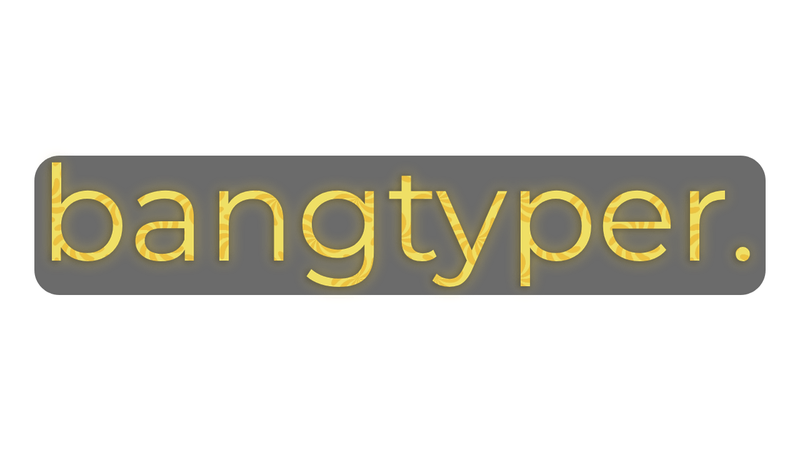
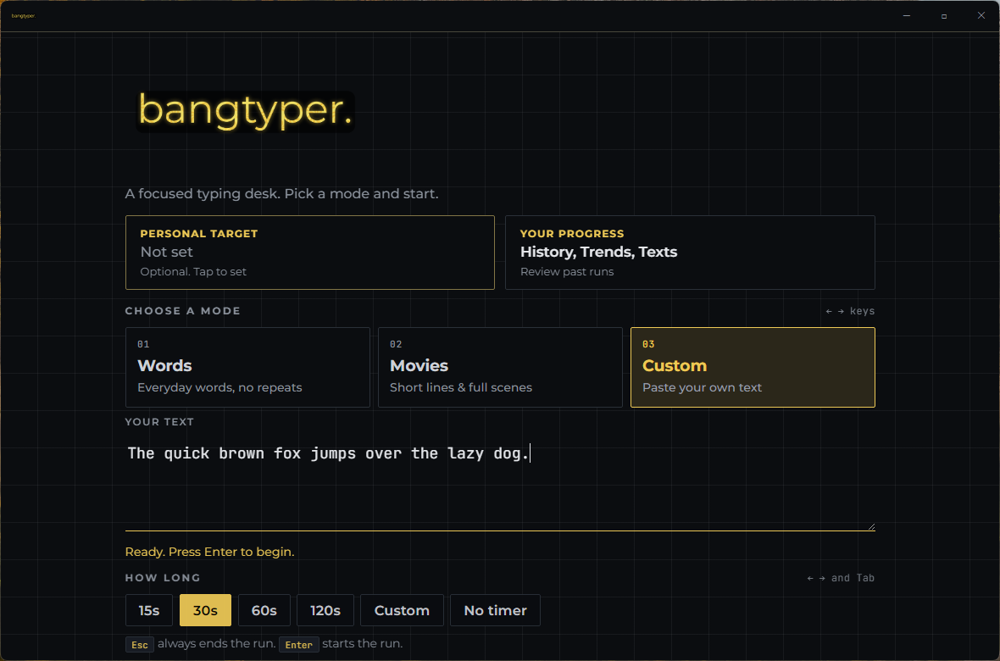
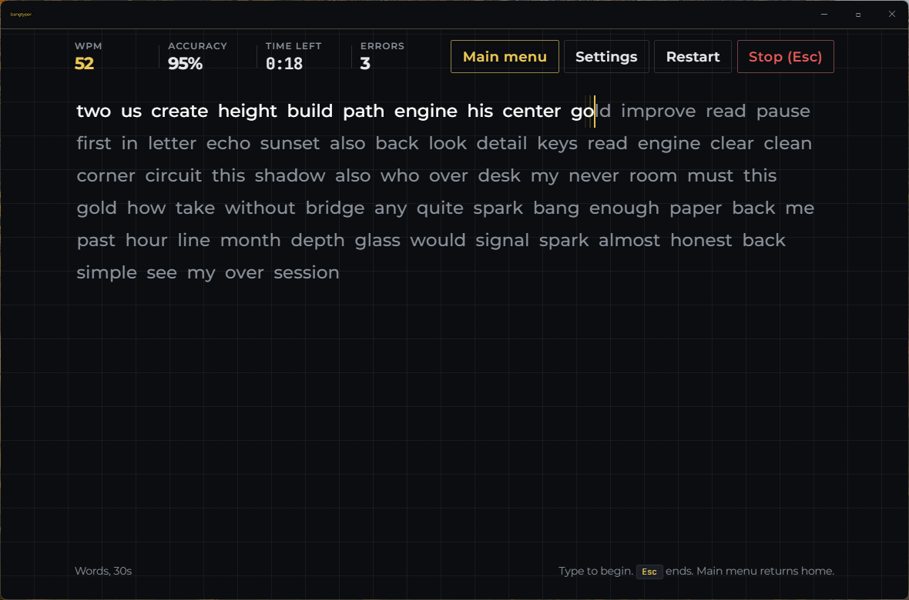
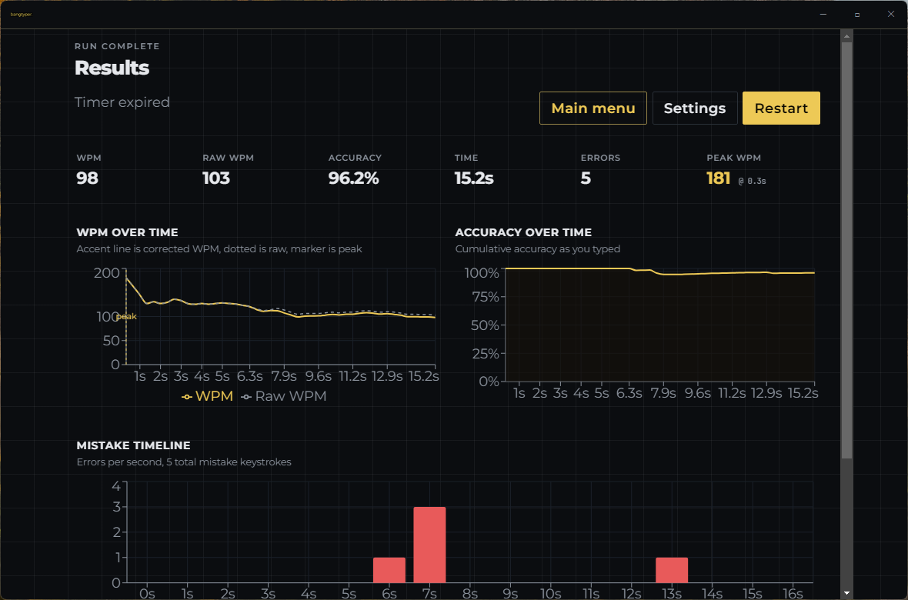
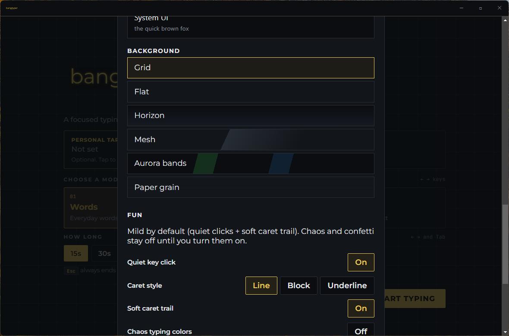
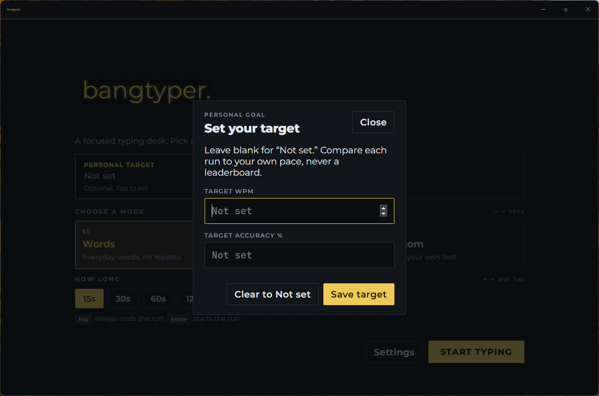
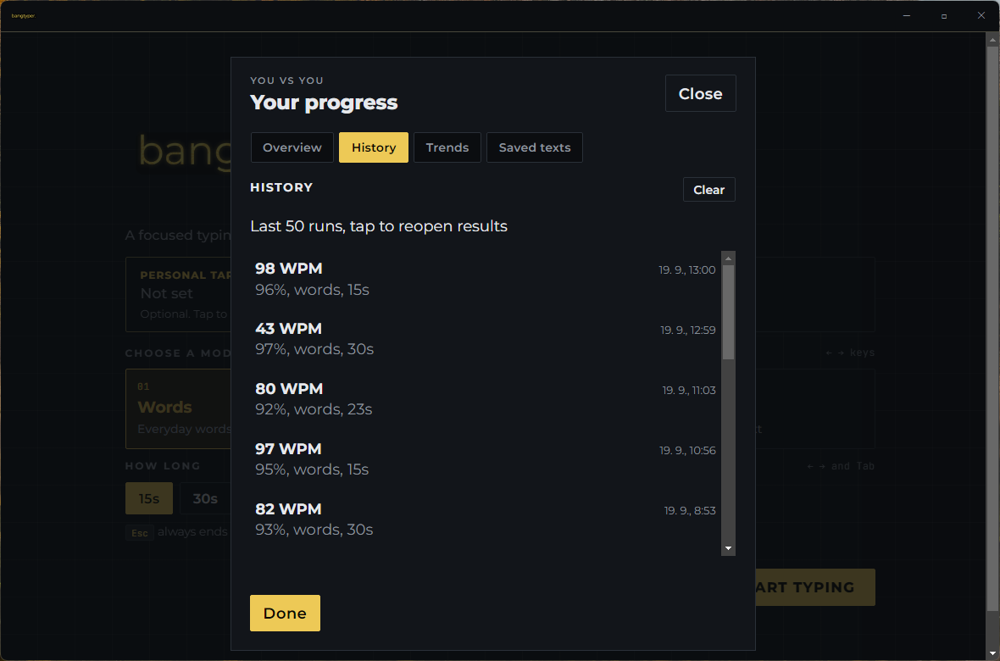

# bangtyper.



Windows desktop typing test. Black + marble gold.

**[Download bangtyper 1.2.6](https://github.com/Xiliank/bangtyper/releases/latest)** · [Releases](releases/latest)

## Screenshots













## Features

- **Modes** — random words, movie-style scripts, custom paste
- **Timer** — 15 / 30 / 60 / 120s presets, custom length, or free run
- **Esc** — ends a run (or returns home before you type)
- **Graphs** — WPM, accuracy, and mistake timeline after each run
- **Settings** — theme, colors, fonts, backgrounds (saved locally)
- **Progress** — optional WPM/accuracy target and local history

## Windows download

1. Open **[Releases → latest](https://github.com/Xiliank/bangtyper/releases/latest)**
2. Download **`bangtyper-1.2.6.exe`** (portable)
3. Run it

The build is **unsigned**. Windows Defender (or other AV) may warn or quarantine a portable Electron exe — choose *More info → Run anyway* if you trust the source, or prefer an **unpacked zip** when one is attached to the same Release (`win-unpacked\bangtyper.exe`).

## Run from source

Node.js 20+ (or current LTS) and npm:

```bash
git clone https://github.com/Xiliank/bangtyper.git
cd bangtyper
npm install
npm run dev:electron
```

Renderer-only (browser UI, not the desktop app):

```bash
npm run dev
```

## License

[MIT](LICENSE)

### bangtyper runs locally. We don’t collect personal data.
